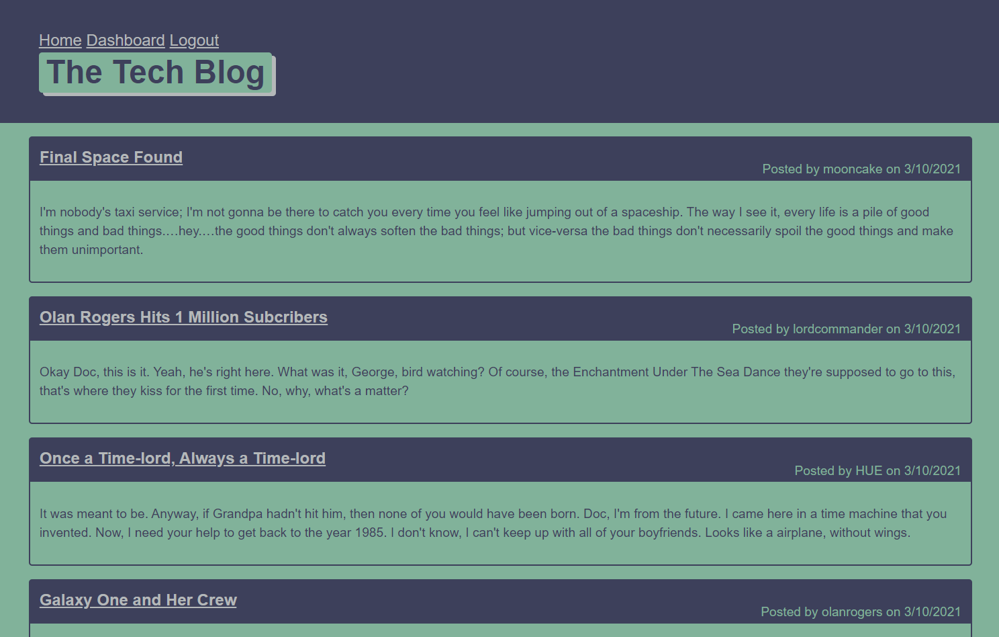

# The Tech Blog

  

  ## Description
  A CMS-style blog site for posting articles about the tech industry. A full stack application that uses a SQL database and Handlebars.js that follows the MVC paradigm for structure.

  

  ## Table of Contents
  * [Installation](#installation)
  * [Usage](#usage)
  * [Built With](#built-with)
  * [Questions](#Questions)
  
  
  
  
  ## Installation
  * Clone the code
  * Navigate to the root folder in your terminal
  * npm install
  * npm run seeds

  ## Usage
  Click here for the deployed application: [The Tech Blog]()

  - The user should run "npm start" to deploy the server
  - Insomnia Core is suggested to test the api endpoints

  ## Built With
  * Node.js
  * Express.js
  * JavaScript
  * MySQL2
  * Handlebars.js
  * Express-handlebars
  * Sequelize
  * Dotenv
  * Bcrypt
  * Express-session
  * Connect-session-sequelize

  ## Questions
  Created by: [kenneththelarson](https://github.com/kenneththelarson)
  
  For further questions please contact [kenneththelarson@gmail.com](mailto:kenneththelarson@gmail.com)

